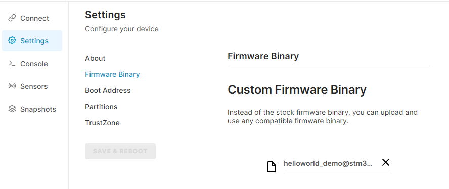
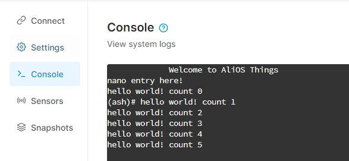
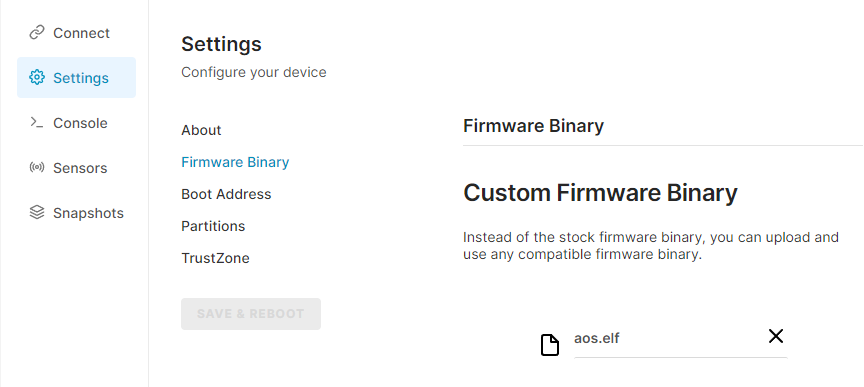
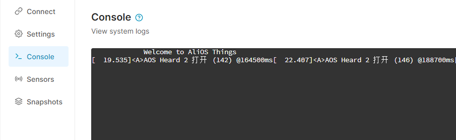

# STM32U5_B_U585I_IOT02A开发板介绍

## 概述

`STM32U5_B_U585I_IOT02A`开发板为`STM32U585AI`微控制器的完整的演示和开发平台，该微控制器基于`Arm Cortex-M33`核心，支持`Arm TrustZone`和`Armv8-M mainline security extension`。该开发板拥有`2 Mbytes Flash`和`786 Kbytes SRAM`，同时拥有一系列外设资源。

该开发板可以用于包括`低功耗通信`、`多路传感`、`直连上云`等一系列物联网应用。

该开发板包括`Wi-Fi`和`Bluetooth`模组，同时拥有麦克风、温度传感器、湿度传感器、磁力计、加速度计、陀螺仪等传感器外设。

`Alios Things`操作系统在`STM32U5_B_U585I_IOT02A`开发板上的移植基于__Arm虚拟硬件__。__Arm虚拟硬件__通过对一众流行的物联网开发平台及其外设的虚拟化，极大加速了软件开发的进程。开发者在软件开发过程中，可以在不需要任何硬件的情况下，在__Arm虚拟硬件__平台进行__嵌入式和物联网应用的测试和验证工作__。

## 硬件资源

* Ultra-low-power STM32U585AII6Q microcontroller based on the Arm® Cortex®‑M33 core with Arm® TrustZone®, 2 Mbytes of Flash memory and 786 Kbytes of SRAM, and SMPS in UFBGA169 package 
* 512‑Mbit Quad-SPI Flash memory, 64‑Mbit Octo‑SPI PSRAM, 256‑Kbit I2C EEPROM
* USB FS, Sink and Source power, 2.5 W power capability
* 802.11 b/g/n compliant Wi‑Fi® module from MXCHIP 
* Bluetooth® Low Energy from STMicroelectronics
* MEMS sensors from STMicroelectronics – 2 digital microphones – Relative humidity and temperature sensor – 3-axis magnetometer – 3D accelerometer and 3D gyroscope – Pressure sensor, 260-1260 hPa absolute digital output barometer – Time-of-flight and gesture-detection sensor
* Ambient-light sensor
* Authentication and security for peripherals and IoT devices from STMicroelectronics 
* 2 user LEDs
* User push-button 
* Reset push-button
* Board connectors – USB Type-C® – ARDUINO® Uno V3 expansion connectors – Camera module expansion connector – 2× STMod+ expansion connectors – Pmod™ expansion connector 
* Flexible power-supply options: ST-LINK USB VBUS, USB connector, or external sources
* On-board STLINK-V3E debugger/programmer with USB re-enumeration capability: mass storage, Virtual COM port, and debug port

## 目录结构

```
stm32u5_b_u585i_iot02a/
|-- config
|-- drivers
|-- package.yaml # AOS编译配置文件
|-- README.md
|-- startup     # 启动文件
|-- pics        # 文档图片
```

## 快速开始

本例程展示了`Alios Things`操作系统提供的`helloworld_demo`示例如何在__Arm虚拟硬件__中运行，需要提前注册Arm账号并申请到AVH第三方硬件的权限。

### 编译

编译AliOS Things的应用。

```bash
$ cd <aos_dir>/solutions/helloworld_demo

$ aos make -b stm32u5_b_u585i_iot02a
```

### 运行

进入Arm虚拟硬件的第三方硬件平台，并创建一个`STM32U5 IoT Discovery Kit`设备。


进入设备页面后，选择`Settings->Firmware Binary`选项卡。

将编译得到的`<aos_dir>/solutions/helloworld_demo/out/helloworld_demo@stm32u5_b_u585i_iot02a.elf`文件拖入固件上传框中，待上传后点击`SAVE & REBOOT`进行重启。



重启之后，进入`Console`选项卡，`Hello World`程序成功运行。



## 基于TFLMicro的AI演示程序

本例程展示了`Alios Things`操作系统提供的`tflite_micro_speech_demo`语音唤醒示例如何在__Arm虚拟硬件__中运行，需要提前注册Arm账号并申请到AVH第三方硬件的权限。例程的具体功能参考`solutions/tflite_micro_speech_demo/README.md`。

### 编译

编译AliOS Things的应用。

```bash
$ cd <aos_dir>/solutions/tflite_micro_speech_demo

$ aos make -b stm32u5_b_u585i_iot02a
```

### 运行

进入Arm虚拟硬件的第三方硬件平台，并创建一个`STM32U5 IoT Discovery Kit`设备。


进入设备页面后，选择`Settings->Firmware Binary`选项卡。

将编译得到的`<aos_dir>/solutions/tflite_micro_speech_demo/aos.elf`文件拖入固件上传框中，待上传后点击`SAVE & REBOOT`进行重启。



进入`Sensors->Camara & Microphone`选项卡，激活麦克风设备。

进入`Console`选项卡，语音唤醒程序成功运行。

